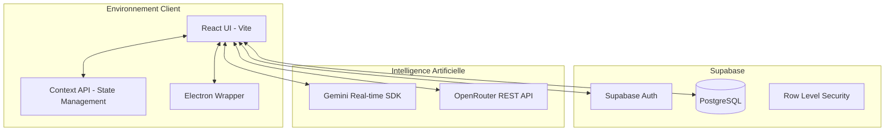

# 🏗️ Architecture Logicielle

## Vue d'Ensemble
L'application **Mon Assistant Scolaire** est une application hybride (Web/Desktop) basée sur une architecture client-serveur moderne où la majeure partie de la logique réside côté client, appuyée par des services tiers (BaaS - Backend as a Service).

---

## 🗺️ Schéma Architectural

---

## 💎 Composants Clés

### 1. Frontend (React + TypeScript)
- **Framework** : React 19 utilisant les Hooks et la Context API pour la gestion d'état globale (Authentification, Thème, Profil enfant actif).
- **Styling** : Tailwind CSS 4 pour un design système moderne, responsive et performant.
- **Animations** : Framer Motion pour des transitions fluides et une sensation "premium".
- **Graphiques** : Recharts pour la visualisation de la progression de l'enfant.

### 2. Services Backend (Supabase)
- **Authentification** : Gestion des comptes parents.
- **Base de Données** : PostgreSQL pour stocker les profils enfants, les scores, les paramètres et les flashcards.
- **Sécurité (RLS)** : Utilisation intensive des politiques Row Level Security pour garantir que chaque parent n'accède qu'aux données de ses propres enfants.

### 3. Couche Intelligence Artificielle
- **Mode Conversationnel (Gemini Live)** : Connexion WebSocket via le SDK Google Generative AI pour l'audio temps réel (faible latence).
- **Mode Tâches (OpenRouter)** : Appels HTTP standard pour générer du contenu structuré (JSON pour les quiz, les mots du jour, les histoires).
- **Prompts System** : Définis dynamiquement selon le niveau scolaire (CP, CE1, etc.) pour adapter le vocabulaire de l'IA.

### 4. Couche Desktop (Electron)
- Permet une exécution native sur Windows/Mac/Linux.
- Gère les interactions avec le système de fichiers ou les périphériques audio de manière plus robuste que dans un navigateur standard.

---

## 🛠️ Modèles de Données (Concepts)

- **Profil Parent** : Le compte principal (User Supabase).
- **Enfant** : Entité liée au parent (Nom, Niveau, Étoiles, Limite de temps).
- **Progression** : Logs d'activités (Date, Sujet, Score) permettant de générer des statistiques.
- **Contenu Généré** : Flashcards et défis stockés pour une consultation ultérieure.

---

## 🛡️ Stratégie de Sécurité
- **Environnement** : Variables sensibles stockées dans `.env`.
- **Validation** : TypeScript pour la sécurité des types à la compilation.
- **Accès** : PIN parental nécessaire pour accéder aux réglages et à la suppression de données.
- **IA** : Filtrage par "System Prompt" pour éviter les contenus inappropriés pour les enfants.
